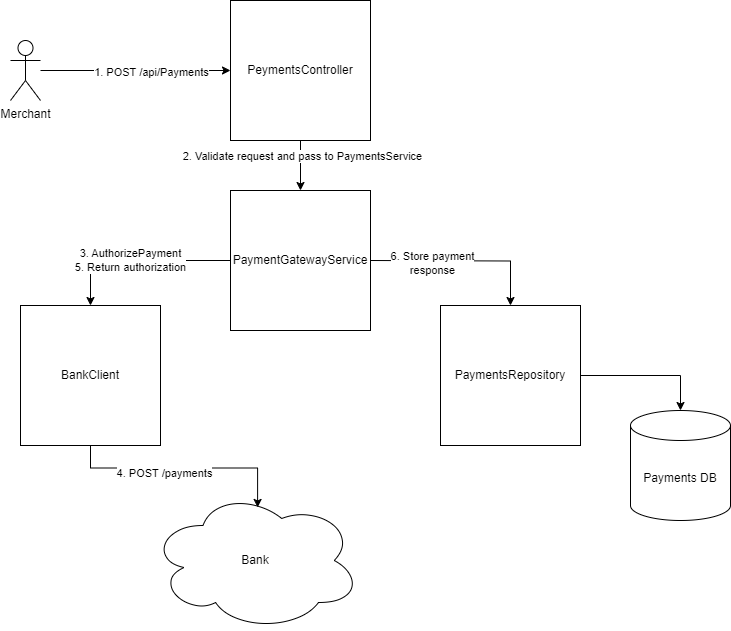

# Payment Gateway - Design

This document describes the design of the Payment Gateway service. The service is implemented as a .NET web application using ASP.NET Core and C#. The service is designed to be a RESTful API that can be called by merchant vendors to make payments. It integrates with bank APIs for checking payment authorization and stores a record of processed payments.

## Requirements

The requirements are described [here](https://github.com/cko-recruitment/.github/tree/beta?tab=readme-ov-file#requirements). In summary:

* A merchant should be able to process a payment through the payment gateway and receive one of the following types of response:
  * Authorized - the payment was authorized by the call to the acquiring bank
  * Declined - the payment was declined by the call to the acquiring bank
  * Rejected - No payment could be created as invalid information was supplied to the payment gateway and therefore it has rejected the request without calling the acquiring bank
* A merchant should be able to retrieve the details of a previously made payment.

## Architecture

The payment gateway service architecture is as follows:



* Controller: serves as the entry point for the API. It receives HTTP requests, validates them and forwards them to the payment gateway service.
* Payment Gateway Service: the core service that processes payment requests. It calls the acquiring bank API to authorize the payment and stores the payment record in the database.
* Payment repository: a repository that stores payment records in a database. It provides methods to save and retrieve payment records.
* Bank client: a client that calls the bank API to authorize payments.

## API specification

### `POST /api/Payments`

Make a payment request.

#### Parameters

None.

#### Request body

```json
{
  "cardNumber": "string",
  "expiryMonth": int,
  "expiryYear": int,
  "currency": "string",
  "amount": int,
  "cvv": "string"
}
```

* `cardNumber`: the card number of the payment card. Must be a string of 14-19 digits.
* `expiryMonth`: the expiry month of the payment card. Must be an integer between 1 and 12.
* `expiryYear`: the expiry year of the payment card. Combination of `expiryMonth` and `expiryYear` must be in the future.
* `currency`: the ISO currency code of the payment. Must be a string of 3 characters.
* `amount`: the amount of the payment. Must be a positive integer, representing the payment amount in the minor currency unit.
* `cvv`: must be 3-4 digits.

#### Responses

`201 Created`: the payment was successfully processed. Response body:

```json
{
  "id": "3fa85f64-5717-4562-b3fc-2c963f66afa6",
  "status": "Authorized|Declined",
  "cardNumberLastFour": "string",
  "expiryMonth": int,
  "expiryYear": int,
  "currency": "string",
  "amount": int
}
```

* `id`: GUID identifying the payment.
* `status`: status of the payment - one of `Authorized` or `Declined`.
* Other fields: as above.

`400 Bad Request`: the request was invalid. Response body:

```json
{
  "status": "Rejected",
  "reason": "string"
}
```

### `GET /api/Payments/{id}`

Retrieve the details of a previously made payment.

#### Parameters

* `id`: GUID identifying the payment.

#### Responses

`200 OK`: the payment was successfully retrieved. Response body:

```json
{
  "id": "3fa85f64-5717-4562-b3fc-2c963f66afa6",
  "status": "Authorized|Declined",
  "cardNumberLastFour": "string",
  "expiryMonth": int,
  "expiryYear": int,
  "currency": "string",
  "amount": int
}
```

`404 Not Found`: the payment with the specified ID was not found.

## Data storage

The payment repository stores records of payments, with the following structure:

```json
{
  "id": "3fa85f64-5717-4562-b3fc-2c963f66afa6",
  "status": "Authorized|Declined",
  "cardNumberLastFour": "string",
  "expiryMonth": int,
  "expiryYear": int,
  "currency": "string",
  "amount": int
}
```

For the initial implementation, the repository is a simple in-memory data store. This is not scalable to large numbers of payments or resilient as the data will be lost if the service terminates. In the future this could be replaced by a scalable NoSQL database.

## Observability

### Logging

The service logs information about requests and responses, as well as errors and exceptions. The logs are written to the console using the standard .NET logging utilities.

### Metrics

The service exposes metrics about its performance and usage using the Prometheus metrics format. The metrics are exposed on the `/metrics` endpoint and can be scraped by a Prometheus server for monitoring.

| Metric | Type | Description | Labels |
|--------|------|-------------|--------|
| `http_requests_total` | Counter | Total number of requests to the payment gateway | `method` |
| `http_responses_total` | Counter | Total number of responses from the payment gateway | `status` |
| `payments_processed_total` | Counter | Total number of payments processed by the payment gateway | `status`, `currency` |
| `payment_processing_time_seconds` | Histogram | Time taken to process a payment | `status` |
| `payment_amounts` | Histogram | Amounts of payments processed by the payment gateway | `status`, `currency` |
| `payments_stored` | Gauge | Number of payments stored in the repository | |

## Testing

The service is tested using unit tests and integration tests.

* Each individual service has unit tests covering its functionality.
* Integration tests run using a simulated bank API to test the service end-to-end.
